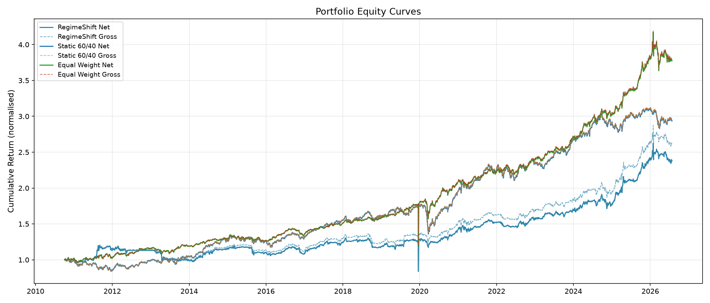
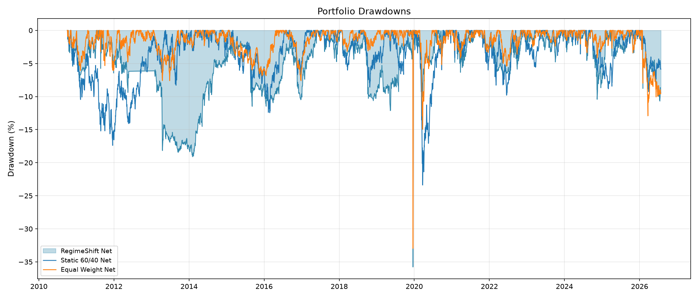
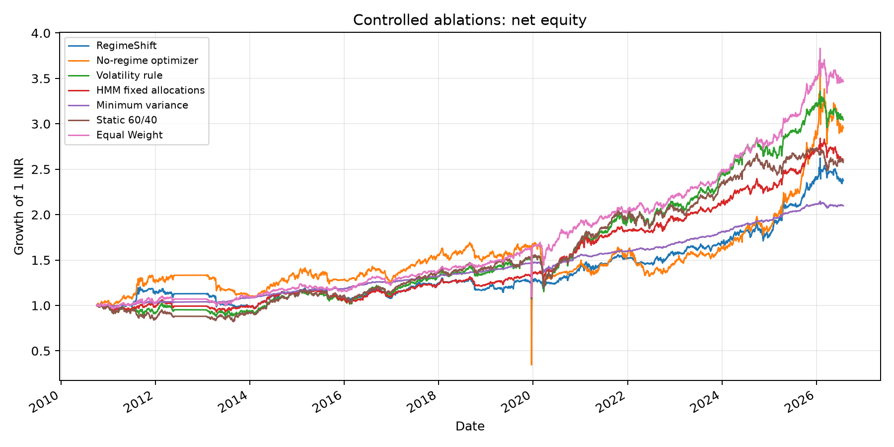
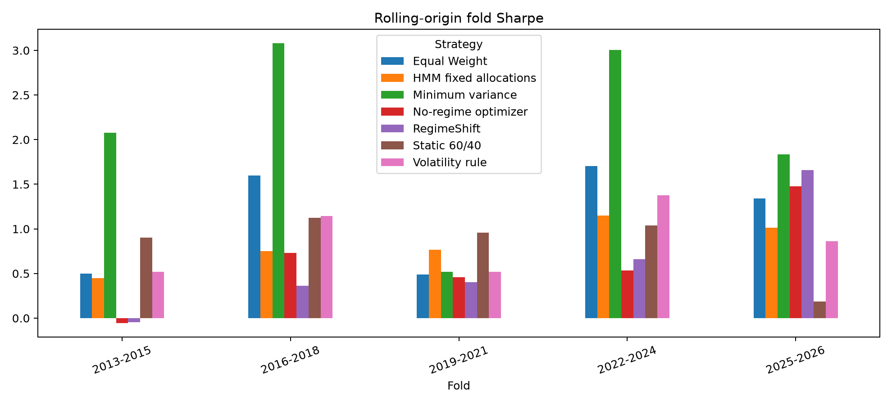
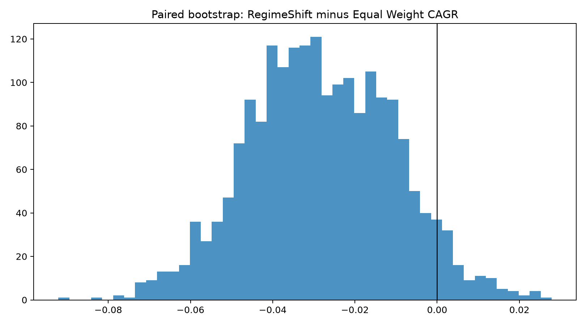

# RegimeShift: causal regime-allocation research

[](https://github.com/tanmay-alpha/RegimeShift/actions/workflows/ci.yml)

RegimeShift is a reproducible quantitative-research case study of Indian multi-asset allocation. It combines leakage-safe features, a three-state Gaussian HMM, CVXPY portfolio construction, causal close-time execution, controlled ablations, chronological evaluation, and paired uncertainty estimates.

## Honest official result

Under causal NEXT_CLOSE execution and a base 10 bps one-way asset-level cost assumption, RegimeShift underperformed both static benchmarks on headline risk-adjusted performance.

The frozen official artefacts are exclusively in [`results/submission/`](results/submission/). They use a common 2010-10-05 to 2026-07-27 horizon (3,732 observations).

| Net strategy | CAGR | Sharpe | Max drawdown |
|---|---:|---:|---:|
| RegimeShift | 6.02% | 0.400 | 35.77% |
| Static 60/40 | 6.60% | 0.697 | 23.39% |
| Equal Weight | 8.75% | 0.570 | 32.96% |





## Research question and causal protocol

Can a regime-aware allocation policy improve a fixed Indian equity/gold/defensive allocation after causal timing and stated trading costs? At close `t`, installed holdings first earn the close-to-close return, then the model observes information through `t`, trades, pays costs, and installs target weights that first earn `t -> t+1`. The engine records this sequence in `execution_timeline.csv`.

The equity leg is `^NSEI`, an index-level signal and return proxy rather than a directly executable fill. Gold uses GOLDBEES and the defensive proxy is LIQUIDBEES. Market impact, capacity, ETF tracking difference, and execution-quality data are not modeled.

## Method

- Leakage-safe features and train-only scaling.
- Three deterministic-restart Gaussian HMM, with state labels based on training information.
- Long-only CVXPY allocation under fixed, predeclared constraints.
- Asset-level 10 bps one-way base costs at close-time rebalances.
- Static 60/40 and equal-weight benchmarks with the same NEXT_CLOSE accounting and horizon.

## Controlled research results

Every policy writes targets into the same causal return, drift, turnover, and cost engine. The full table is [`results/research/ablation_summary.csv`](results/research/ablation_summary.csv).

| Finding | Evidence |
|---|---|
| HMM vs no-regime optimizer | HMM improves Sharpe (0.400 vs 0.280) and reduces drawdown (35.77% vs 79.57%). |
| CVXPY vs fixed HMM allocations | Fixed HMM allocations have higher Sharpe (0.635 vs 0.400) and lower drawdown (19.61% vs 35.77%). |
| Transparent volatility rule | The simple rule has Sharpe 0.532 with lower turnover (0.883 annualised vs 3.318). |
| Complexity and turnover | The full optimizer has the highest turnover of the principal dynamic variants. |







## Evaluation and uncertainty

Development is 2010-10-05 to 2018-12-31, validation is 2019-01-01 to 2021-12-31, and 2022-01-01 to 2026-07-27 is a retrospective evaluation period. This is a retrospective evaluation period, not a pristine holdout, because the complete historical sample had been inspected during earlier development.

The paired moving-block bootstrap uses 21 trading-day blocks, 2,000 samples, seed 42, and 95% intervals. For RegimeShift minus Static 60/40 Sharpe, the interval includes zero; no statistical-significance claim is made. See [`bootstrap_benchmark_differences.csv`](results/research/bootstrap_benchmark_differences.csv) and [`rolling_origin_summary.csv`](results/research/rolling_origin_summary.csv).

## Reproduce

```powershell
pip install -e ".[dev]"
python run_submission.py --data-path data/submission_market_data.csv --cost-scenario base --output-dir results/submission
python scripts/run_research_suite.py
python scripts/build_notebook.py
python -m jupyter nbconvert --to notebook --execute notebooks/RegimeShift_Submission.ipynb --inplace --ExecutePreprocessor.timeout=3600
python -m pytest -q
python scripts/verify_release.py
```

## Limits

This is retrospective research, not proven alpha or an investment recommendation. `^NSEI` is not directly tradable; capacity, market impact, tax, and real execution constraints are excluded. Negative benchmark and ablation findings remain public by design.

## Artefacts

- [Executed notebook](notebooks/RegimeShift_Submission.ipynb)
- [Institutional research report](reports/RegimeShift_Quant_Research_Report.pdf)
- [Data documentation](data/README.md)
- [MIT code license](LICENSE) and [data notice](DATA_LICENSE_NOTICE.md)
